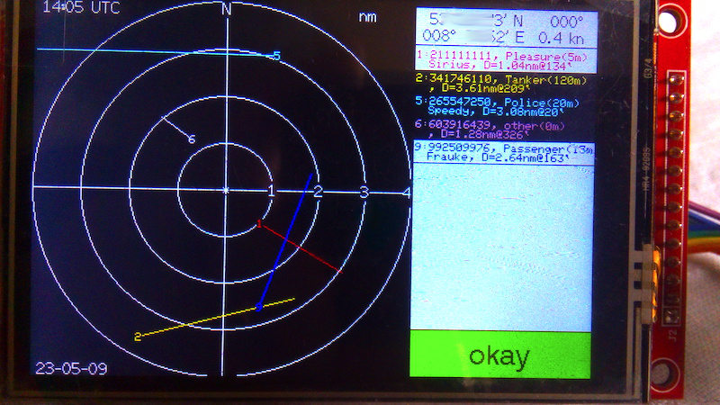
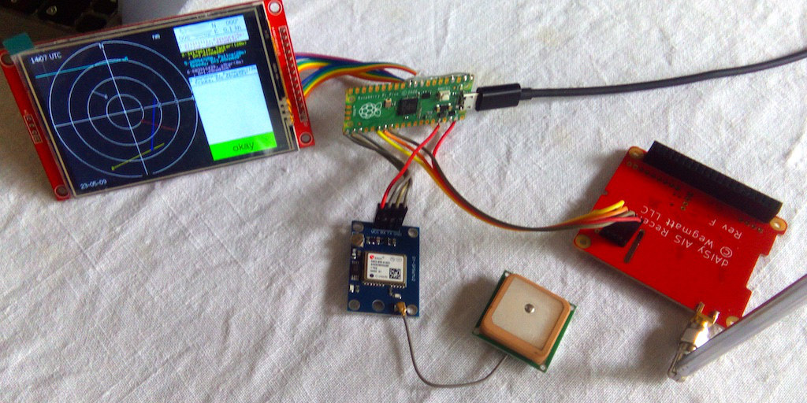
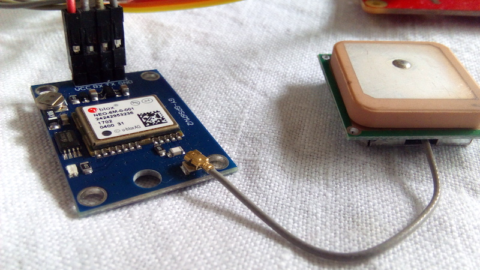
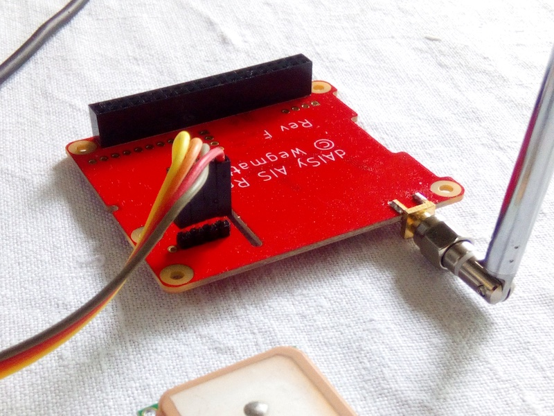

# AIS Radar
This project is a low cost implementation of a AIS receiver with a radar like display.
The power source can be a USB power bank to become mobile.

It's based on a Raspberry Pi Pico microcontroller and can display the position, course and speed of up to 11 ships in the neighborhood.
Speed and course are represented by a colored line. The line starts with a number as identifier at the current position of the ship.
It ends at the estimated position of the ship in 10 minutes.

If a ship comes closer than 0.2 nautical miles an alarm is triggered.

Up to 11 different ships can be displayed simultaneously.

**! Only ships sending AIS messages are displayed!**

### Hardware
- Raspberry Pi pico RP2040
- TFT SPI 480x320 px 3.5\" 
- serial output GPS module with antenna (I used a ublox NEO 6M module)
- serial output AIS receiver with antenna (I used a "dAISy HAT - AIS Receiver" from https://wegmatt.com/)
- USB power bank
- USB cable to connect the power bank to the Pico
- some wires
- housing

### Soldering
#### Display

| PICO GPIO | SPI Display |
|-----------|-------------|
|2 |DC/RS|
|1 |CS|
|7 |SDI(MOSI)|
|6 |SCK|
|0 |RESET|
|8 |SDO(MISO)|
|3.3V (OUT)|VCC|
|VBUS (+5V)|LED|
|GND |GND|

#### GPS module

| PICO GPIO | GPS module |
|-----------|------------|
|16 |RX|
|17 |TX|
|3.3V (OUT)|VCC|
|GND |GND|

#### AIS receiver

| PICO GPIO |AIS receiver|
|-----------|------------|
|20 |RX|
|21 |TX|
|VBUS(+5V)|VCC|
|GND |GND|

### Software
To compile your own AIS radar (if you want to modify the code or use other pins or hardware, ...) you need a the Arduino environment with the Board "Raspberry Pi Pico/RP2040" installed.
You also need some libraries that I used:
- TFT_eSPI  from https://github.com/Bodmer/TFT_eSPI by Bodmer. **! Edit the "User\_Setup.h" in library/TFT\_eSPI/ folder to meet display and pins!**_
- UnixTime from https://github.com/GyverLibs/UnixTime Alex Gyver <alex@alexgyver.ru>
- AIS-master from https://github.com/KimBP/AIS Kim Bøndergaarg <kim@fam-boendergaard.dk>

### Installation
#### With Arduino
- Edit the "User\_Setup.h" in Arduino/library/TFT\_eSPI/ folder to meet display and pins
- Connect your Pico to an USB port of your computer while pressing the "BOOTSEL" button
- Release the button
- Open Arduino environment
- Select Pico as your board
- Copy the files "AIS\_Radar.ino" and "functions.h" to a new sketch
- Be sure that Upload Method is Default (UF2)
- Press the Upload button

#### With the binary
- Connect your Pico to an USB port of your computer while pressing the "BOOTSEL" button
- Copy the file "AIS\_Radar.uf2" to the mounted Pico folder

### Manual
- Power on the AIS-Radar by connecting the Pico USB port to your power bank.
- Wait a few minutes to get a GPS fix. (on screen the message changes from "no fix" to "okay")
- On the right side of the display will be a table.
- The first two lines give your position, course and speed.
- When a ships enters your vicinity (observed area is a circle around your position with a radius of 5 nautical miles), it will be shown as a colored line on the left side on the radar map and as double line in the table on the right side in the same color.
- If AIS\_Radar also receives type 24 messages according an existing mmsi, ship type, length and/or name is also shown.
- 2.4nm@165' means: the ship is 2.4 nautical miles away on 165° degree.